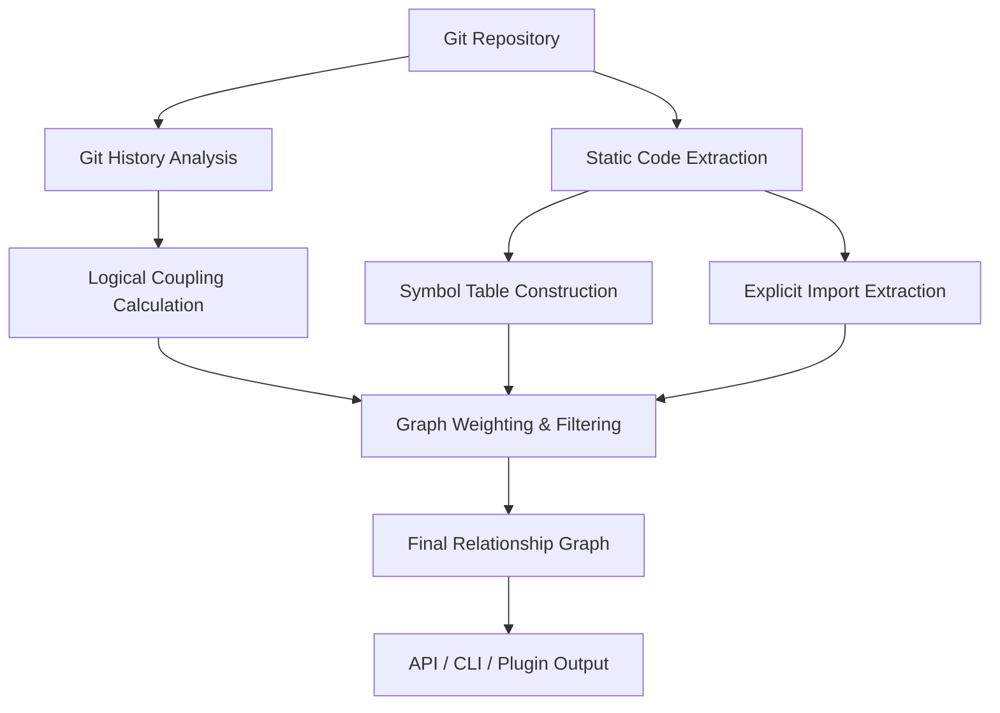

# Development Habits and Architectural Principles

This document summarizes the core principles and development habits established during the evolution of `gossiphs`, specifically regarding its evaluation against compiler-based benchmarks like SCIP.

## 1. Metric Priorities
- **Symbol Level**: Focus exclusively on **Precision**. We care about whether the symbols gossiphs finds are "true" definitions/references. Recall is secondary as gossiphs is designed to be lightweight.
- **File Level**: Focus on both **Precision and Recall**. This is the primary dimension for architectural analysis. We aim to capture the "Main Road" of the project (Physical Dependencies) while providing "Bonus" insights (Logical Coupling).

## 2. Dependency Extraction Philosophy
- **Explicit > Implicit**: Prefer explicit code signals (e.g., `import`, `use`, `require` statements) over implicit heuristics (e.g., directory proximity).
- **Physical Link Weighting**: Links backed by explicit code imports should receive a massive score boost (e.g., 100.0) to ensure they appear at the top of the relation list.
- **Logical Coupling**: Git history serves as a supplement to find hidden dependencies that static analysis misses (e.g., config files linked to code).

## 3. Handling Symbol FQNs
- **Base Name Matching**: Since gossiphs often lacks full type resolution, use "Base Name" matching (matching the suffix of a symbol name) to bridge the gap between simple names and Fully Qualified Names (FQNs) used by indexers like SCIP.
- **Collision Mitigation**: To prevent "Simple Name Collisions" (e.g., `New`, `init`), enforce strict filters:
    - Non-qualified names require a physical link or high commit intersection (>= 3).
    - Qualified names require at least 1 common commit.
- **Dynamic Specificity Filtering (IDF)**: Use Inverse Document Frequency to weight symbols. Rare symbols (high IDF) contribute more to the score than common ones (low IDF, e.g., `init`).
- **Adaptive Collision Mitigation**: Instead of hard counts, use `Confidence = IDF * JaccardSimilarity`. Links with low confidence are pruned unless backed by physical evidence.
- **Score-Gap Pruning**: When multiple definitions match a reference, only keep those within 80% of the top score. This prevents "ambiguous" links from polluting the graph.

## 4. Evaluation Habits
- **Full History**: Always use full Git history (`depth: 0` or large enough) for evaluation to capture long-term logical coupling.
- **Dimensional Alignment**: Always compare results at the **File Level**. Symbol-to-symbol links from indexers should be aggregated into file-to-file links for fair comparison.
- **Internationalization**: All evaluation scripts and reports must be in English to support global collaboration.

## 5. Performance and Scaling
- **Monorepo Support**: For large monorepos, use the `commit_size_limit_ratio` to ignore "fat commits" that create noise.
- **Incremental Analysis**: Leverage the `.gossiphs/cache` for faster iterations during evaluation.

## 6. System Workflow

The pipeline combines two main signal sources:
1. **Dynamic Signals (Git)**: Extracts "Logical Coupling" by looking at files that tend to change together.
2. **Static Signals (Tree-sitter)**: Extracts "Physical Dependencies" through explicit imports and symbol definitions.

These are merged into a unified graph where physical links serve as ground truth (high weight) and logical links provide architectural context.
