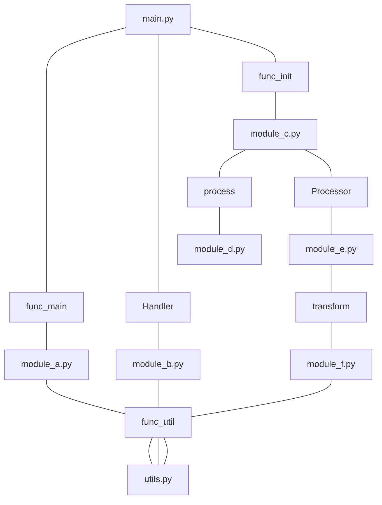

# Gossiphs = Gossip Graphs

> [!TIP]
> We provide an easy-to-use Python SDK and support for MCP (Model Context Protocol), allowing you to seamlessly
> integrate it with your AI.
>
> See [Gossiphs MCP Server](./mcp/README.md)


[](https://github.com/williamfzc/gossiphs/actions/workflows/cargo-test.yml)

"Zero setup" & "Blazingly fast" general code file relationship analysis. With Python & Rust. Based on tree-sitter and
git analysis. Support MCP and ready for AI🤖

## What's it

Gossiphs can analyze the history of commits and the relationships between variable declarations and references in your
codebase to obtain a relationship diagram of the code files.

It also allows developers to query the content declared in each file, thereby enabling free search for its references
throughout the entire codebase to achieve more complex analysis.



## Supported Languages

We are expanding language support based
on [Tree-Sitter Query](https://tree-sitter.github.io/tree-sitter/code-navigation-systems), which isn't too costly.
If you're interested, you can check out the [contribution](#contribution) section.

| Language   | Status |
|------------|--------|
| Rust       | ✅      |
| Python     | ✅      |
| TypeScript | ✅      |
| JavaScript | ✅      |
| Golang     | ✅      |
| Java       | ✅      |
| Kotlin     | ✅      |
| Swift      | ✅      |
| C#         | ✅      |

You can see the [rule files](./src/rule.rs) here.

## Usage

### Python

```bash
pip install gossiphs
```

Analyze your codebase with networkx within 30 lines:

```python
import networkx as nx
from gossiphs import GraphConfig, create_graph, Graph

config = GraphConfig()
config.project_path = "../.."
graph: Graph = create_graph(config)

nx_graph = nx.DiGraph()

for each_file in graph.files():
    nx_graph.add_node(each_file, metadata=graph.file_metadata(each_file))

    related_files = graph.related_files(each_file)
    for each_related_file in related_files:
        related_symbols = set(each_symbol.symbol.name for each_symbol in each_related_file.related_symbols)

        nx_graph.add_edge(
            each_file,
            each_related_file.name,
            related_symbols=list(related_symbols)
        )

print(f"NetworkX graph created with {nx_graph.number_of_nodes()} nodes and {nx_graph.number_of_edges()} edges.")

for src, dest, data in nx_graph.edges(data=True):
    print(f"{src} -> {dest}, related symbols: {data['related_symbols']}")
```

Output:

```text
NetworkX graph created with 13 nodes and 27 edges.
src/server.rs -> src/main.rs, related symbols: ['server_main']
src/main.rs -> src/graph.rs, related symbols: ['default']
src/main.rs -> examples/mini.rs, related symbols: ['default']
src/main.rs -> src/server.rs, related symbols: ['main']
src/symbol.rs -> src/graph.rs, related symbols: ['link_file_to_symbol', 'list_references', 'list_references_by_definition', 'id', 'enhance_symbol_to_symbol', 'add_file', 'add_symbol', 'list_definitions', 'list_symbols', 'new', 'link_symbol_to_symbol', 'get_symbol']
...
```

More [examples](./py_wrapper/examples) can be found here.

### Others

We also provide a CLI and additional usage options, making it easy to directly export CSV files or start an HTTP
service.

See [usage page](./docs/usage.md).

## Goal & Motivation

> [!TIP]
> Create a file relationship index with:
> - low cost
> - acceptable accuracy
> - high versatility for nearly any code repository
>

Code navigation is a fascinating subject that plays a pivotal role in various domains, such as:

- Guiding the context during the development process within an IDE.
- Facilitating more convenient code browsing on websites.
- Analyzing the impact of code changes in Continuous Integration (CI) systems.
- ...

In the past, I endeavored to apply [LSP/LSIF technologies](https://lsif.dev/) and techniques
like [Github's Stack-Graphs](https://dcreager.net/talks/stack-graphs/) to impact analysis, encountering different
challenges along the way. For our needs, a method akin to Stack-Graphs aligns most closely with our expectations.
However, the challenges are evident: it requires crafting highly language-specific rules, which is a considerable
investment for us, given that we do not require such high precision data.

We attempt to make some trade-offs on the challenges currently faced by
stack-graphs to achieve our expected goals to a certain extent:

- Zero repo-specific configuration: It can be applied to most languages and repositories without additional
  configuration.
- Low extension cost: adding rules for languages is not high.
- Acceptable precision: We have sacrificed a certain level of precision, but we also hope that it remains at an
  acceptable level.

## How it works

Gossiphs constructs a graph that interconnects symbols of definitions and references.

1. Extract imports and exports: Identify the imports and exports of each file.
2. Connect nodes: Establish connections between potential definition and reference nodes.
3. Refine edges with commit histories: Utilize commit histories to refine the relationships between nodes.

Unlike stack-graphs, we have omitted the highly complex scope analysis and instead opted to refine our edges using
commit histories.
This approach significantly reduces the complexity of rule writing, as the rules only need to specify which types of
symbols should be exported or imported for each file.

While there is undoubtedly a trade-off in precision, the benefits are clear:

1. Minimal impact on accuracy: In practical scenarios, the loss of precision is not as significant as one might expect.
2. Commit history relevance: The use of commit history to reflect the influence between code segments aligns well with
   our objectives.
3. Language support: We can easily support the vast majority of programming languages, meeting the analysis needs of
   various types of repositories.

## Precision

> Static analysis has its limits, such as dynamic binding.
> Therefore, it is unlikely to achieve the level of accuracy provided by LSP, but it can offer sufficient accuracy in
> the areas where it is primarily used.

The method we use to demonstrate accuracy is to compare the results with those of LSP/LSIF. It must be admitted that
static inference is almost impossible to obtain all reference relationships like LSP.

You can further combine your own needs and use other methods such as tfidf to process the results to meet more complex
requirements.

| Repo                             | Coverage of LSP Edges by Gossiphs |
|----------------------------------|-----------------------------------|
| https://github.com/go-gorm/gorm  | 442/499 = 88.5 %                  |
| https://github.com/gin-gonic/gin | 238/252 = 94.4%                   |

## Contribution

The project is still in a very early and experimental stage. If you are interested, please leave your thoughts through
an issue. In the short term, we hope to build better support for more languages.

You just need to:

1. Edit rules in [src/rule.rs](src/rule.rs)
2. Test it in [src/extractor.rs](src/extractor.rs)
3. Try it with your repo in [src/graph.rs](src/graph.rs)

[Tree-sitter Playground](https://tree-sitter.github.io/tree-sitter/playground) is a good helper.

## License

[Apache 2.0](LICENSE)
