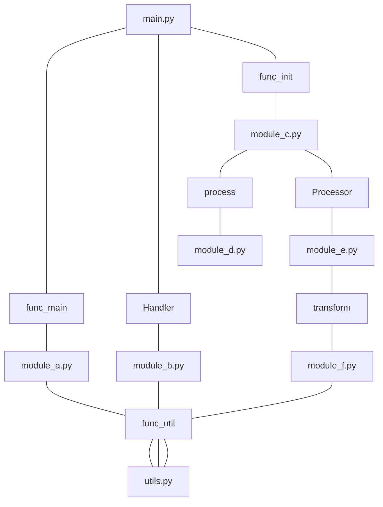

# gossiphs_mcp

[gossiphs](https://github.com/williamfzc/gossiphs) wrapper for Model Context Protocol (MCP)

## Goal

The goal is to expose gossiphs' code analysis capabilities in a simple way (MCP). It can quickly analyze code relationship graphs without the need to start an LSP, providing more contextual input for AI analysis without requiring any additional configuration.



## Installation

Install with pipx:

```shell
pipx install gossiphs-mcp
```

Start an MCP server:

```shell
# stdio by default
gossiphs-mcp server

# using SSE
gossiphs-mcp server --transport=sse
```

## Usage

> Using cursor as an example. Of course, other clients can also be used.

First, configure the server:


Then, when needed, cursor can automatically call gossiphs to analyze the impact scope of files and collaborate with other tools!


